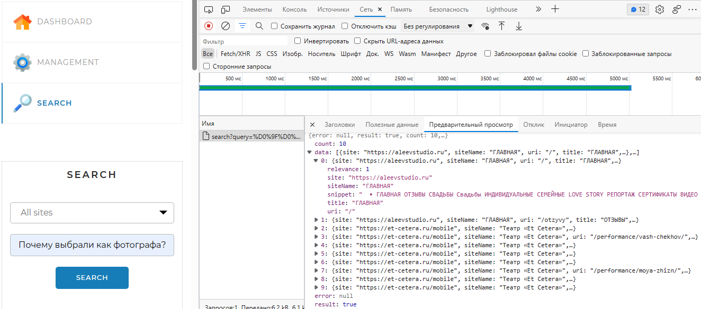
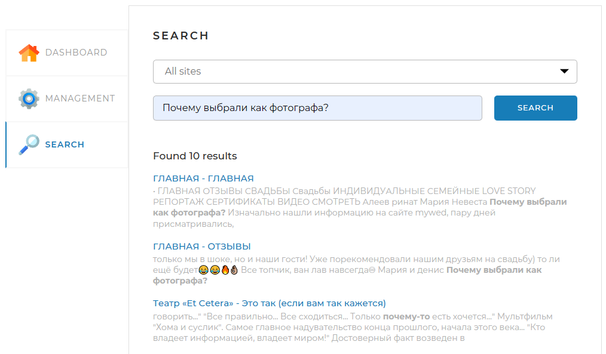

## Описание проекта 

Представлен поисковый движок - Spring-приложение, работающее с локально установленной базой данных MySQL*, имеющее простой веб-интерфейс и API, через который им можно управлять и получать результаты поисковой выдачи по запросу.

\* \- структура базы данных приведена на скрине № 0.

Принципы работы поискового движка:

1) В интерфейсе приложения задаются адреса сайтов, по которым движок должен осуществлять поиск (см. скрин № 2).
2) Поисковый движок самостоятельно обходит все страницы заданных сайтов и индексирует их так, чтобы потом находить наиболее релевантные страницы по любому поисковому запросу.
3) Пользователь присылает запрос через API движка. Запрос — это набор слов, по которым нужно найти страницы сайта.
4) Запрос определённым образом трансформируется в список слов, переведённых в базовую форму. Например, для существительных — именительный падеж, единственное число.
5) В индексе ищутся страницы, на которых встречаются все эти слова.
6) Результаты поиска ранжируются, сортируются и отдаются пользователю (см. скрин № 5).

Как это выглядит:

Скрин № 0


Скрин № 1


- Главная страница, с уже добавленными сайтами. 


Скрин № 2


- Добавляем новую страницу - используем кнопку "ADD/UPDATE".
- Если повторить вышеуказанную операцию с сайтом, который был ранее добавлен, то произайдет "/UPDATE". 


Скрин № 3


- Сайт добавлен.
- Далее используем кнопку "START INDEXING" (см. скрин № 2), для обхода страницы и добавления составляющих в базу данных.

Примечание № 1: "Если есть один и более сайтов со статусом "INDEXING", то обход страницы будет реализован для всех таких страниц"

Примечание № 2: "После начала индексации появляется кнопка "STOP". Тем самым можно остановить программу и все что проиндексировалось - сохранится"

Скрин № 4


Все сайты проиндексированы

Скрин № 5


Поиск выполен:

- count — общее кол-во результатов;

- data:
1)  site — если сайт не указан, поиск происходит по всем сайтам из списка;
2)  siteName — заголовок главной страницы;
3)  uri — путь к странице вида;
4)  title — заголовок страницы;
5)  snippet — фрагмент текста, в котором найдены совпадения;
6)  relevance — релевантность страницы.

- error — в случае когда запрашивается пустая форма, программа выдает об этом ошибку.

Скрин №6

Общий вид

***
## Инструкция по запуску

Требуется:
- Docker
- Java 17
- Maven


1. В терминале из корня проекта запустить:
```
docker-compose up -d mysql_test
```

2. После установки бд для тестирования запустить:
```
mvn clean install
```

3. Как проект соберется, выполнить команду для создания образа:
```
docker build -t search_engine:1.0 .
```

4. Поднять контейнер и начать пользоваться:
```
docker-compose up -d
```
